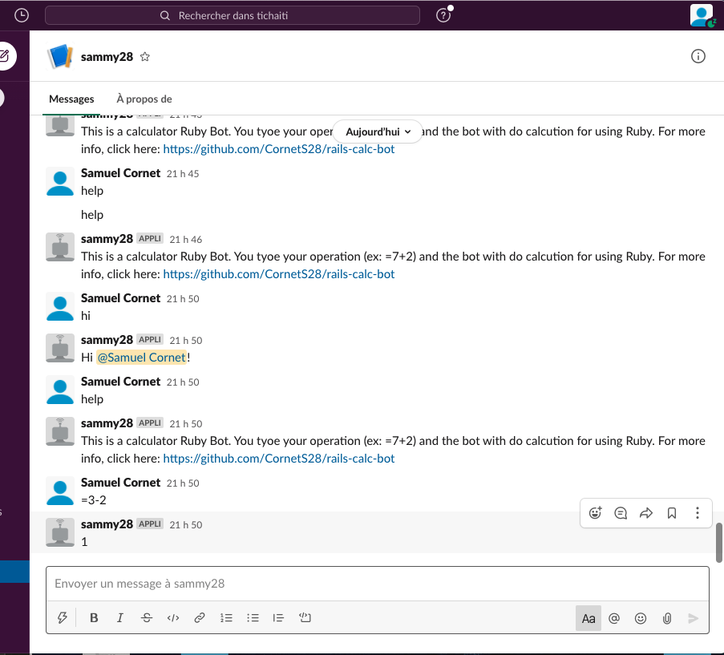

# Rails-Calc-Bot

This a 100% Ruby application

# Table of Contents

- [rails-calc-bot](#rails-calc-bot)
- [Table of Contents](#table-of-contents)
  - [Screenshots](#screenshots)
  - [Requirements](#requirements)
  - [Usage](#usage)
  - [Publishing for Staging/Demoing](#publishing-for-stagingdemoing)
  - [Building for Production](#building-for-production)
  - [demovideo](#demo-video)


## Screenshots



## Requirements

To run this application, you will need Ruby installed. No database needed.
You will also need to create a Slack account (if you do not have one). Assuming, you already have an account, you will need to go to link (http://slack.com/services/new/bot) to generate a token. Once you're on the page:
 1. Create a username
 2. Click on the Green Button that says "Add Bot Integration"
 3. Save the generated API token, and
 4. Scroll to the bottom of the page and click on "Save Integration"


## Usage

- Clone the repo and enter the project folder

```
git clone https://github.com/CornetS28/rails-calc-bot
cd rails-calc-bot
```

- Create a.env file and set the temporary and global as followed: SLACK_API_TOKEN=add-your-api-token-here


- Install dependencies: `bundle install`


To run the app by typing this command:

``` rackup ```

Once done, you should see infomation in your terminal telling that the app is up running.

Now go to Slack (assuming your logged in). You should now see the username you've created. From there, 
- you can type ```hi``` and the bot will respond properly
- you can type ```help``` for more infomation
- you can type any math operation. For examle: ```=4-3``` and it shall respond back ```1```


That should be enough!

## publishing-for-stagingdemoing

TBD

## Building for Production

TBD

## Testing
TBD

### Demo Video
TBD

